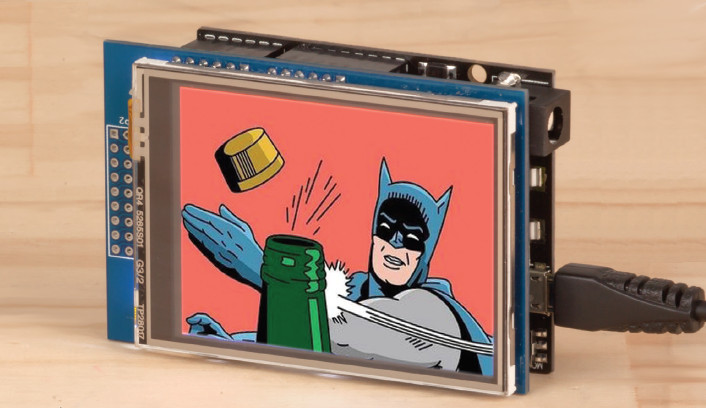
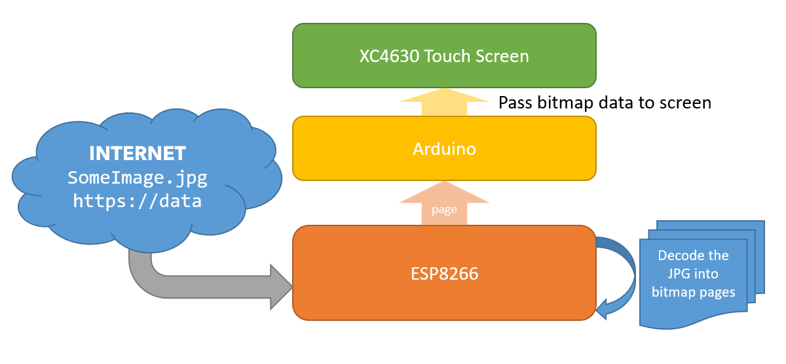
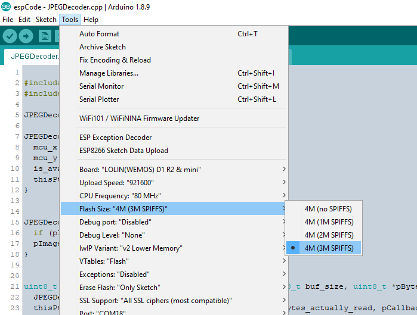
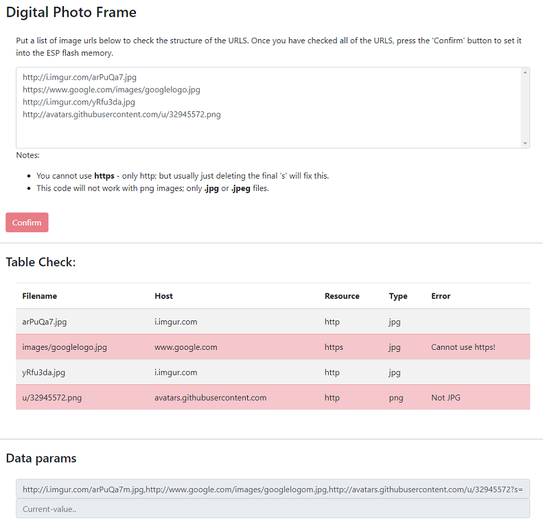

# Digital Photo Frame

 Use our new WiFi UNO and 240 x 320 TFT screen!

Share your memories or get the latest in memes automatically with this Wi-Fi enabled Photo Frame. Using our newest UNO with Wi-Fi board and a 320x240 touch screen display, simply provide a list of JPEG links and the photo frame will rotate through and display them automatically.

Can be used with the popular service IMGUR to get daily content automatically.

| Input     | Output  |
| --------- | ------- |
| Image URL | Display |



## Table of contents

- [Digital Photo Frame](#Digital-Photo-Frame)
  - [Table of contents](#Table-of-contents)
  - [Bill of materials](#Bill-of-materials)
  - [Software & Libraries](#Software--Libraries)
  - [System Overview](#System-Overview)
    - [WiFi decoder](#WiFi-decoder)
      - [Jpeg decoding](#Jpeg-decoding)
    - [Arduino Display](#Arduino-Display)
  - [Integration](#Integration)
  - [Use](#Use)
  - [Future Improvements](#Future-Improvements)
  - [Further reading](#Further-reading)
    - [Web Fundamentals](#Web-Fundamentals)
    - [APIs](#APIs)
    - [Decoding](#Decoding)

## Bill of materials

| Qty | Code                                     | Description            |
| --- | ---------------------------------------- | ---------------------- |
| 1   | [XC4411](https://jaycar.com.au/p/XC4411) | Uno with WiFi          |
| 1   | [XC4630](https://jaycar.com.au/p/XC4630) | 240 x 320 Touch screen |

## Software & Libraries

| Library       | Author         | Version |
| ------------- | -------------- | ------- |
| MCUFRIEND_kbv | David Prentice | 2.9.8 * |
| Adafruit GFX  | Adafruit       | 1.5.6   |

- The `MCUFRIEND_kbv` library must be modified to work with XC4630; read more on the manual of the product page
    - <https://jaycar.com.au/p/XC4630>
- We also use Bodmer's JPEGDecoder library; however we had to modify it it work with the setup, for ease it is included in the espCode section, but check out his work at:
    - <https://github.com/Bodmer/JPEGDecoder>
- You will need the **ESP Data upload tool**, found at
    - <https://github.com/esp8266/arduino-esp8266fs-plugin>

## System Overview



The meat of the processing is done on the ESP side of things, where it will fetch the file and store it onto it's on board `SPIFFS` memory; from there, each time an image is requested, it will load the data and decode it into a proper bitmap stream; then it will move that stream through the serial lines to be received by the arduino.

The arduino simply receives the datastream and outputs it onto the screen; you can see how slow it updates through the requirement of having to do the bitmap section by section; each of these sections correspond to a different part of the `JPEG` packing from the decoder.

We had to modify the JPEGDecoder library to make it work for our purposes. By streaming the data over the serial, we also need to stream information such as where in the image the particular section is; this is done by sending a `>>>` start tag to signal that there is a new data block coming in.

The ESP code relies on imgur's thumbnail generation; given a photo URL, by appending a small  letter 'm' to the filename, we can receive the "medium thumbnail" (320x320) which is of a close enough resolution for our (somewhat small, in a modern-media sense) 240x320 screen.

To start with we are using the IMGUR service, but we will happily accept pull requests for code to get data from google photos.

### WiFi decoder

| Dip switch settings | 1   | 2   | 3   | 4   | 5   | 6   | 7   | 8   |
| ------------------- | --- | --- | --- | --- | --- | --- | --- | --- |
|                     |     |     |     |     | ON  | ON  | ON  |     |
|                     | OFF | OFF | OFF | OFF |     |     |     | OFF |

- Use the code in the `espCode` folder and make sure your arduino Board is set to the `LOLIN (WeMos) D1 R2 & Mini`. If you don't have this option in your board menu, make sure you read the instruction page on <https://jaycar.com.au/p/XC3802>

Open the **espCode** folder in your arduino IDE and upload to the board; you can enable or disable the debug settings via the `#define DEBUG` near the top of the file; the DEBUG define will allow you to read more about the data, including what might be going wrong while developing.

You must also upload the data filesystem, which is done using the ESP data upload tool from the [Software & Libraries](#Software--Libraries) section.

When using the **Data upload tool** AND the **espCode** you must set the correct flash size so that the arduino IDE can format the data partition correctly.  All this means is setting the right options in the IDE for `Flash Size`: in this project we are using `4M (3M SPIFFS)` which means using 4 megabytes of memory, reserving 3 for the `data/` folder and the remaining 1 megabyte for the program data.



#### Jpeg decoding

When we use the `JPEGDecoder.decode()` function; we reserve a section in memory for a portion of the image to be decoded, then read the image portion by portion with the `JPEGDecoder.read()` function; from each page of the bitmap, we send that information through the serial port to be picked up by the uno.

Each portion of the jpg image is called a "Minimum Coding Unit" and is specified in the header of the jpg image; thats why at the start of the `sendRender()` function, we read the `MCUWidth` and `MCUHeight`. We use these values to form a bounding rectangle of which part of the image that we are reading;

```cpp
uint16_t *pImg; //pointer to uint16 block
while( JpegDec.read()) //read() will return 0 when no data left to decode
{
    pImg = JpegDec.pImage; //get copy of pointer to page;

    // calculate where the image block should be drawn on the screen
    uint16_t mcu_x = JpegDec.MCUx * mcu_w;
    uint16_t mcu_y = JpegDec.MCUy * mcu_h;

    // check if the image block size needs to be changed for the right and bottom edges
    win_w = (mcu_x + mcu_w <= max_x) ? mcu_w : min_w;
    win_h = (mcu_y + mcu_h <= max_y) ? mcu_h : min_h;

    // calculate how many pixels must be drawn
    uint16_t mcu_pixels = win_w * win_h;

    // draw image MCU block only if it will fit on the screen
    #define WIDTH 320
    #define HEIGHT 240

    if ((WIDTH < mcu_x + win_w) || (HEIGHT < mcu_y + win_h)){
        //abort
        JpegDec.abort();
        //todo send 'quit' token?
        break;
    }
    //otherwise, set bounding window
    uint32_t param_x = mcu_x + win_w -1;
    uint32_t param_y = mcu_y + win_h -1;

    // now instead of sending it to the screen: there is no screen attached to the ESP;
    // we send it to the arduino instead.

    Serial.print(F(">>>"));      //start of data tag
    send16(mcu_pixels);         // number of pixels
    send16(mcu_x);              // position x
    send16(mcu_y);              // position y
    send32(param_x);
    send32(param_y);

    //while (mcu_pixels--) send16(0x5555); //this is a test pattern, shows blueish.

    while (mcu_pixels--)
        send16(*pImg++); //for each pixel, send16, increment pointer to loop through the data on this page.

}
```

`send16()` and `send32()` are functions to simply send 2 and 4 byte integers; these are matched up by `read16()` and `read32()` on the arduino side.

### Arduino Display

| Dip switch settings | 1   | 2   | 3   | 4   | 5   | 6   | 7   | 8   |
| ------------------- | --- | --- | --- | --- | --- | --- | --- | --- |
|                     |     |     | ON  | ON  |     |     |     |     |
|                     | OFF | OFF |     |     | OFF | OFF | OFF | OFF |

Open up the `unocode` folder in the arduino IDE and set the board type to Geniuno **UNO**.

The arduino section of the code receives the serial data from the ESP and sends it to the TFT screen.

```cpp
//TODO: activate the touch function:
//    : We would love to accept a pull request from you guys!
```

Thanks to the `MCUFRIEND` library, we have the ability to `setAddrWindow()` for the TFT screen, meaning we can update the data at certain points of memory; which is exactly what we want when only managing to decode portions of the image at a time.

```cpp
void receiveRender()
{
    // loop until we read 3 '>' in a row to signify the start of a block.
    int count = 0;
    while(count < 3){
        if (char(read()) == '>')
            count++;
        else
            count = 0; //if it's malformed; chuck out everything and start afresh.
    }

    // start of image data;

    datalen = read16(); // first value is how big the packet is
    mcu_x = read16();   // where is the x
    mcu_y = read16();   // where is the y
    param_x = read32(); // what is the width
    param_y = read32(); // what is the height

    tft.setAddrWindow(mcu_x, mcu_y, param_x, param_y);

    uint16_t block = 0;
    bool first = true;

    while(datalen--){
        block = read16();
        tft.pushColors(&block, 1, first);
        first = false;
    }
}
```

Here there is plenty of room to send data back and forth between the ESP and arduino; send through touch events and load a touch panel of image selections.

## Integration

Before integrating, make sure that the `espCode` has your local WiFi settings in the `wireless_name` and `wireless_password` parameters, near the top of the page.

Once you're happy with the two halves working independently, change the dip switches as shown below then put the shield on top of the Uno With Wifi.

| Dip switch settings | 1   | 2   | 3   | 4   | 5   | 6   | 7   | 8   |
| ------------------- | --- | --- | --- | --- | --- | --- | --- | --- |
|                     | ON  | ON  |     |     |     |     |     |     |
|                     |     |     | OFF | OFF | OFF | OFF | OFF | OFF |

## Use

Turn on the device and go to the device IP address, or try <http://photoframe.local> from your home computer. You should be presented with a text box where you can put multiple image urls;



The device can't handle `.PNG` or `HTTPS://` schemes, making it limited scope. The code also automatically appends a small 'm' to the image url so to activate the imgur thumbnailer.

We are using **Vue.js** and **Bootstrap** to make an impressive and interactive web-app; you can read more about it here: <https://bootstrap-vue.js.org/>

The Vue engine can allow us to easily expand and provide proper formatting of data, including managing the data table and correctly highlighting errors when they arise. Both Vue and Bootstrap are loaded by the `index.html` in the data folder.

Ultimately this is a less than ideal setup with plenty of room for improvements; which is where you guys come in with Pull requests: we are happy to accept comments, general tidy ups, radical improvements, etc.

## Future Improvements

There is plenty of improvements that can be done; here are some shoutouts if people want to contribute to; and we love pull requests.

- The screen is 320x240; but our images from imgur are 320x320; meaning 80pixels must be clipped off the end. Instead of clipping it off the end, it would be great to calculate this beforehand and clip it evenly by 40 each side, so that the images are more centred in the photo frame.
- The website is basic; we'd love to jazz it up a bit, maybe provide a bit of input validation and css effects.
- Provide a way to submit just an entire imgur album; Due to the limitations of the module it won't be able to do gif images but it should be able to rotate through the rest of the album; such as "most popular" albums.
- Google photo integration would make a great desktop reminder for your most recent holiday photographs.

## Further reading

### Web Fundamentals

- <https://tttapa.github.io/ESP8266/Chap09%20-%20Web%20Server.html>

### APIs

- <https://developers.google.com/photos/>
- <https://apidocs.imgur.com/?version=latest>

### Decoding

- <http://www.es.ele.tue.nl/mininoc/doc/jpeg_mmips.htm>
- <https://en.wikipedia.org/wiki/JPEG>
- <https://en.wikipedia.org/wiki/Portable_Network_Graphics>
- <https://github.com/Bodmer/JPEGDecoder>
- <https://code.google.com/archive/p/picojpeg/>
